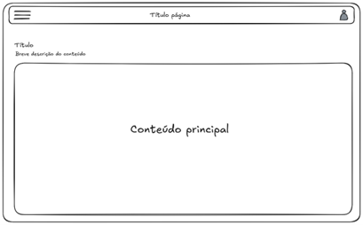
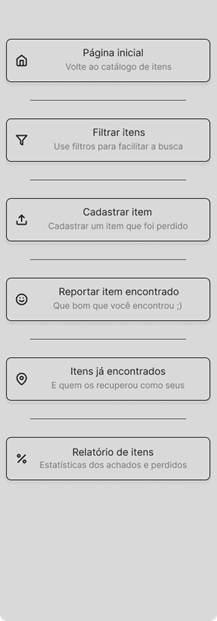

# 3. Projeto de Interface

A construção da interface do sistema foi orientada pelos princípios de simplicidade, clareza e acessibilidade, visando facilitar a interação dos usuários com o serviço de achados e perdidos.

O protótipo das interfaces está disponível para visualização no Figma através do seguinte link:
[Acessar Protótipo no Figma](https://www.figma.com/design/wZEecyreVDyH4Vut5tU12J/Projeto-de-interfaces---TIAW?node-id=0-1&t=qQ5BQKLY08MEwD30-1)

## 3.1. Wireframe

O wireframe apresentado define a estrutura fundamental que será padrão para todas as interfaces do projeto. Seu objetivo é estabelecer uma identidade visual consistente, focando em simplicidade, usabilidade e organização eficiente dos elementos de tela. Ele segue a seguinte estrutura:

- **Header (cabeçalho) fixo no topo:**
  - Menu hamburguer no canto esquerdo: abertura de um menu para navegação entre as páginas.
  - Título da página centralizado: identificação clara da seção atual.
  - Ícone de usuário no canto direito: acesso rápido a opções de perfil ou autenticação.
- **Área de Conteúdo (sub-header):**
  - Título da seção: reforça o contexto da página ativa.
  - Breve descrição: introdução ou explicação rápida sobre o conteúdo exibido.
- **Bloco principal de conteúdo:**
  - Área centralizada e destacada para exibição do conteúdo principal da página.
  - Espaço amplo e com margens, priorizando a leitura, a interação e a responsividade.

_Figura: Wireframe_

## 3.2. Fluxo do Usuário

A navegação principal da aplicação será realizada por meio de um menu, disponível em todas as páginas, garantindo acesso rápido e intuitivo às principais funcionalidades. O fluxo de usuário foi planejado para ser simples e objetivo, proporcionando a melhor experiência possível para quem deseja registrar, buscar ou consultar informações sobre itens perdidos e encontrados.

_Figura: Fluxo do usuário_

## 3.3. Interfaces

### Tela - Homepage

Esta tela exibe o catálogo dos achados e perdidos, com uma seção de "Itens relevantes".

_Figura: Interface menu principal_

### Tela - Busca item

Permite ao usuário pesquisar e filtrar itens perdidos ou encontrados para localizar objetos de forma rápida. Os filtros incluem data, tipo de item (Documentos, Garrafas, Material escolar, etc.) e se o item foi encontrado ou perdido.

_Figura: Interface menu de busca de itens_

### Tela - Registrar item perdido

Um formulário para o usuário preencher os dados para registrar um item perdido, incluindo informações do item (título, categoria, descrição), informações sobre a perda (data, hora, local) e uma imagem.

_Figura: Interface menu de registro de item perdido_

### Tela - Registrar item encontrado

Um formulário para o usuário preencher os dados para registrar um item que encontrou, incluindo informações do item, informações sobre o encontro (data, hora, local) e uma imagem.

_Figura: Interface menu de registro de item encontrado_

### Tela - Relatórios

Exibe um resumo dos itens perdidos e encontrados registrados no sistema, com estatísticas como total de itens perdidos, total de itens encontrados, itens devolvidos e itens ainda não devolvidos.

_Figura: Interface menu de relatórios_

### Tela - Login e Cadastro

Interfaces para o usuário entrar no sistema com e-mail e senha ou se registrar para uma nova conta.

_Figura: Interface menu de registro_

_Figura: Interface menu de entrada_

### Menu

O menu de navegação lateral permite acesso às seguintes seções:

- Página inicial
- Filtrar itens
- Cadastrar item (perdido)
- Reportar item encontrado
- Itens já encontrados
- Relatório de itens

_Figura: Interface do menu_
